# Intra-Trace Reasoning Uncertainty: Detecting and Repairing Premature Commitment in LLM Thinking

## Central Claim

A single reasoning trace from a thinking model (QwQ-32B, DeepSeek-R1) encodes structured epistemic signals — convergence dynamics, self-uncertainty markers, and commitment signatures — that predict answer correctness better than answer-level semantic entropy, at **1/5th the compute**. Detected failure modes enable targeted, training-free repair.

## The Paradigm Shift

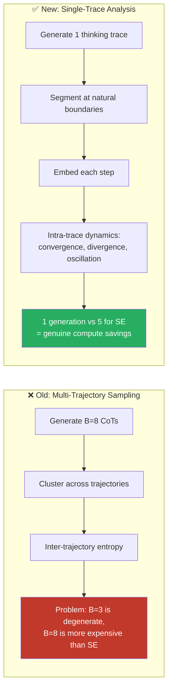

> [!IMPORTANT]
> **Why this works**: QwQ-32B and DeepSeek-R1 emit `<think>...</think>` blocks containing natural reasoning pivots — "Wait," "Let me reconsider," "Actually," double newlines. These are **model-defined** step boundaries, not arbitrary 128-token chunks. The model's own trace is already internally diverse: it debates, branches, backtracks, and revises within a single generation.

---

## Narrative Arc: Detect → Diagnose → Repair

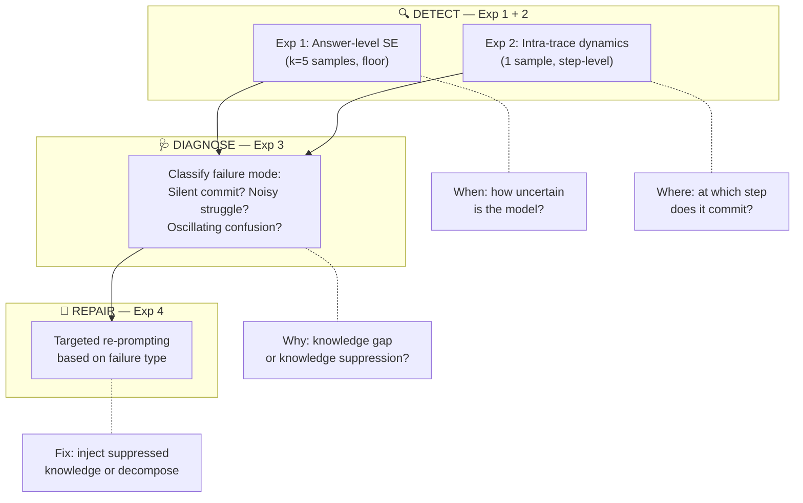

---

## Design Decisions

| Decision                                                    | Rationale                                                                                                            |
| ----------------------------------------------------------- | -------------------------------------------------------------------------------------------------------------------- |
| **Single trace, not multi-trajectory**                      | B=3 gives degenerate entropy; B=8 costs more than SE. Single trace with natural steps is cheaper AND more principled |
| **Natural boundaries, not token chunks**                    | QwQ/R1 emit reasoning pivots ("Wait", "Actually"). Model-defined, not arbitrary                                      |
| **Intra-trace similarity, not inter-trajectory clustering** | No k-means on 3 points. Cosine similarity sequence is clean and well-defined                                         |
| **QwQ-32B + DeepSeek-R1-7B**                                | Reasoning models with `<think>` traces. Fit user's compute. Cross-model validation                                   |
| **MATH Level 3-5, not GSM8K**                               | GSM8K >95% acc for 70B+ → ceiling effects. MATH has genuine difficulty                                               |
| **Drop PubMedQA**                                           | Known label quality issues                                                                                           |
| **Cluster rationales not MCQ letters**                      | MedQA is 4/5-way MCQ — NLI on letters A/B/C/D is meaningless                                                         |
| **Pilot tests FIRST**                                       | 2-3 days to validate core assumptions before 9-week commitment                                                       |

---

## Models & Infrastructure

| Component             | Choice                                     | Rationale                                                          |
| --------------------- | ------------------------------------------ | ------------------------------------------------------------------ |
| **Primary reasoning** | QwQ-32B-Preview                            | Open-weight reasoning model, `<think>` traces, fits user's compute |
| **Validation model**  | DeepSeek-R1-Distill-Qwen-7B                | Smaller reasoning model, cross-model validation                    |
| **Embeddings**        | BGE-M3 (dense mode)                        | Strong on short domain text                                        |
| **NLI**               | DeBERTa-v3-large + MedNLI-finetuned        | Answer equivalence                                                 |
| **Inference**         | vLLM                                       | Efficient generation                                               |
| **Datasets**          | MedQA (1273 test) + MATH Level 3-5 (~1500) | Medical + mathematical reasoning                                   |

> [!WARNING]
> **MedQA is MCQ.** For Exp 1 baseline, cluster the **rationale text** (the model's natural-language diagnosis), not the letter answer. This makes SE measure reasoning diversity, not just answer diversity.

---

## Experiment 1: Vanilla Semantic Entropy Baseline (Floor)

**Goal**: Establish answer-level uncertainty performance. Everything must beat this.

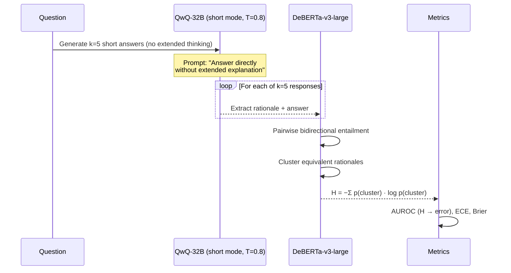

| Detail            | Value                                                   |
| ----------------- | ------------------------------------------------------- |
| Samples           | k=5                                                     |
| Temperature       | 0.8                                                     |
| Clustering object | Rationale text, not MCQ letter                          |
| NLI               | DeBERTa-v3-large (general) + MedNLI-finetuned (medical) |
| Datasets          | MedQA, MATH Level 3-5                                   |
| Metrics           | AUROC, ECE, Brier, wall-clock time                      |
| Expected AUROC    | ~0.65-0.72                                              |

**Compute cost**: 5 full generations per question. This is the floor.

#### [NEW] [baseline_semantic_entropy.py](file:///home/mohit_joshi/rlm%20for%20uncertanity/src/baseline_semantic_entropy.py)

---

## Experiment 2: Intra-Trace Reasoning Dynamics (Core Contribution)

**Hypothesis**: A single thinking trace contains step-level dynamics that predict correctness — incorrect reasoning exhibits **premature convergence** while correct reasoning maintains **productive divergence** before converging.

### Step 1: Natural Boundary Segmentation

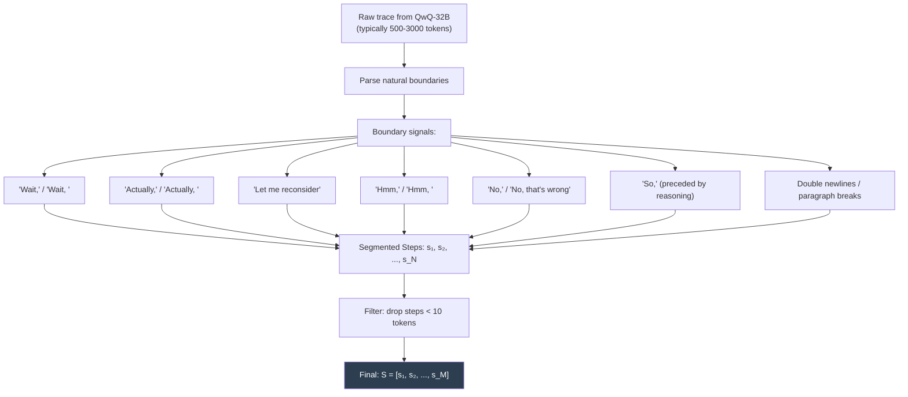

### Step 2: Step Embedding & Dynamics

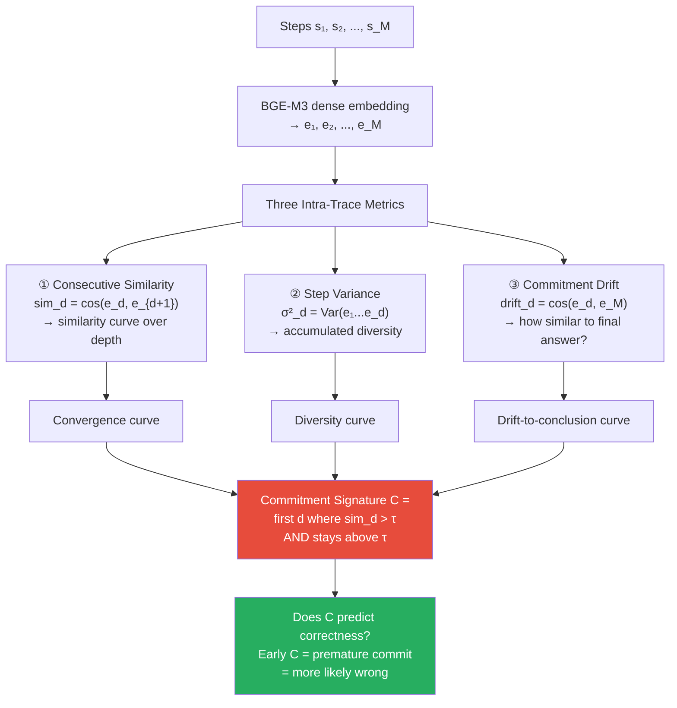

### What Gets Measured

| Question                                                        | How                                     |
| --------------------------------------------------------------- | --------------------------------------- |
| Does C correlate with correctness?                              | AUROC of C → error                      |
| Do incorrect traces converge faster?                            | Mann-Whitney on mean sim_d              |
| Does similarity curve shape predict better than answer-level H? | Compare AUROC: curve features vs. Exp 1 |
| Compute advantage?                                              | 1 gen vs 5 → wall-clock ratio           |

**Hero visualization**: Similarity curves over depth, colored by correctness (correct = blue, stays low then rises; incorrect = red, rises early).

### Key Difference from Prior Work

| Aspect               | Semantic Entropy                | Ours                             |
| -------------------- | ------------------------------- | -------------------------------- |
| Input                | k=5 separate generations        | **1 thinking trace**             |
| Measures             | Answer diversity across samples | Step dynamics within one trace   |
| Cost                 | 5× generation                   | **1× generation**                |
| Commitment detection | Not possible                    | **Yes — commitment signature C** |

#### [NEW] [trace_segmenter.py](file:///home/mohit_joshi/rlm%20for%20uncertanity/src/trace_segmenter.py)

#### [NEW] [trace_dynamics.py](file:///home/mohit_joshi/rlm%20for%20uncertanity/src/trace_dynamics.py)

#### [NEW] [commitment_signature.py](file:///home/mohit_joshi/rlm%20for%20uncertanity/src/commitment_signature.py)

---

## Experiment 3: Failure Mode Diagnosis

**Goal**: Not just _that_ the model is wrong, but _why_ — which determines what repair works.

### Self-Uncertainty Markers (Free Signal)

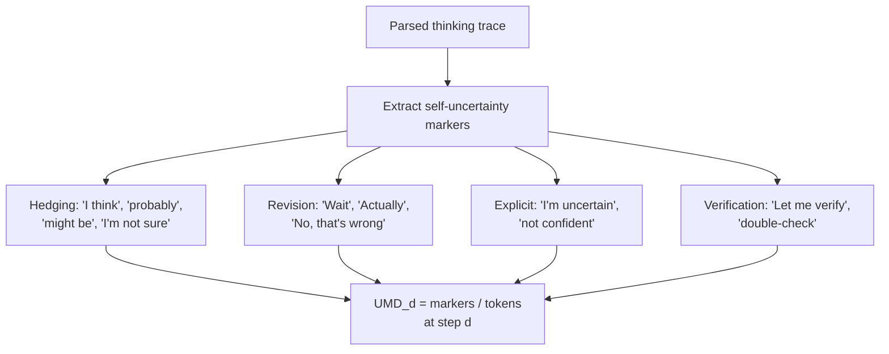

### Three Failure Modes

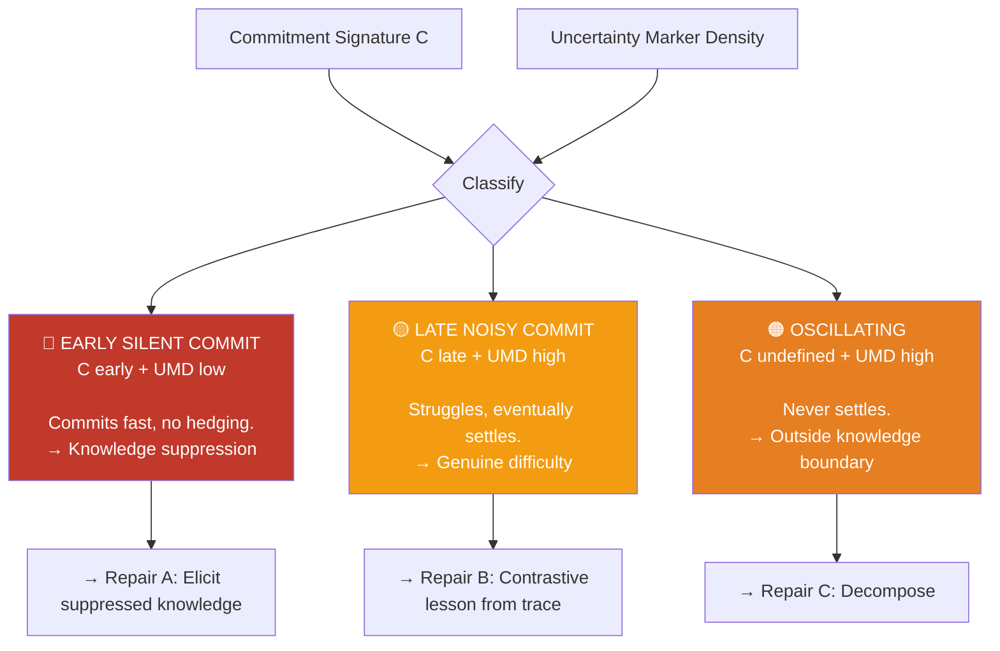

| Metric                                               | Method                                            |
| ---------------------------------------------------- | ------------------------------------------------- |
| Do failure modes map to different accuracy profiles? | Accuracy within each mode                         |
| Is UMD at commitment point predictive?               | Spearman(UMD_C, correctness)                      |
| Domain differences?                                  | MedQA (expect more N) vs MATH (expect more LNC) |

#### [NEW] [uncertainty_markers.py](file:///home/mohit_joshi/rlm%20for%20uncertanity/src/uncertainty_markers.py)

#### [NEW] [failure_modes.py](file:///home/mohit_joshi/rlm%20for%20uncertanity/src/failure_modes.py)

---

## Experiment 4: Targeted Step-Level Repair (The Payoff)

**Repositioned claim**: "Intra-trace uncertainty signals are better selectors and teachers than answer-level signals for inference-time reasoning improvement."

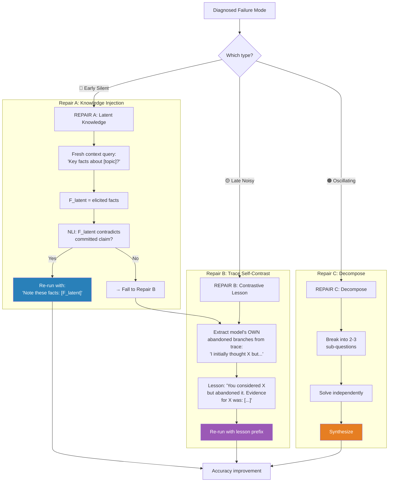

### Why This Is NOT Reflexion

|                              | Reflexion                | Ours                                     |
| ---------------------------- | ------------------------ | ---------------------------------------- |
| Feedback                     | Oracle (ground truth)    | Intra-trace signals (no labels)          |
| Compared                     | Output vs correct answer | Model's own abandoned branches vs commit |
| Lesson type                  | "I got X wrong"          | "You considered Y but abandoned it"      |
| Works without correct trace? | No                       | **Yes**                                  |

### Baselines

| Baseline                                   | Controls for                  |
| ------------------------------------------ | ----------------------------- |
| Vanilla re-run (different seed)            | Stochasticity                 |
| Best-of-5 self-consistency                 | Multi-sample selection        |
| Reflexion (oracle feedback)                | Oracle-label intervention     |
| Undifferentiated repair (Repair A for all) | Value of failure-mode routing |

> [!IMPORTANT]
> **Table 3 design**: Show repair improves accuracy most on ESC subset, where suppressed knowledge injection targets the exact failure mechanism. Reflexion can't match this because it doesn't know _why_ the model failed.

#### [NEW] [repair_pipeline.py](file:///home/mohit_joshi/rlm%20for%20uncertanity/src/repair_pipeline.py)

#### [NEW] [latent_knowledge.py](file:///home/mohit_joshi/rlm%20for%20uncertanity/src/latent_knowledge.py)

---

## Known Drawbacks & Mitigations

| #   | Drawback                                            | Severity | Mitigation                                                                |
| --- | --------------------------------------------------- | -------- | ------------------------------------------------------------------------- |
| 1   | Natural boundaries may be rhetorical, not epistemic | High     | Pilot Test 1 validates; fallback: hidden-state cosine drops               |
| 2   | Self-uncertainty markers uncalibrated               | High     | Pilot Test 3; if Spearman < 0.15, drop markers, diagnose from C alone     |
| 3   | Single trace = no inter-sample diversity            | Medium   | Trace contains abandoned branches; Exp 1 provides inter-sample comparison |
| 4   | BGE-M3 may not separate short steps                 | High     | Pilot Test 2; fallback: model's own hidden states                         |
| 5   | Commitment threshold τ is arbitrary                 | Medium   | Calibrate on 10% held-out; sensitivity over τ ∈ {0.7-0.9}                 |
| 6   | Results may not generalize beyond QwQ/R1            | Medium   | Validate on both models; explicit limitation                              |
| 7   | F_latent in Repair A may hallucinate                | Medium   | T=0.0 greedy; NLI contradiction acts as filter                            |
| 8   | Not all traces contain abandoned branches           | Medium   | Measure fraction; no-branch traces fall to Repair C                       |

---

## Pilot Validation Tests (Week 1 — Run FIRST)

> [!CAUTION]
> 2-3 days total. If any fails, redesign before investing 9 weeks.

### Pilot 1: Trace Structure

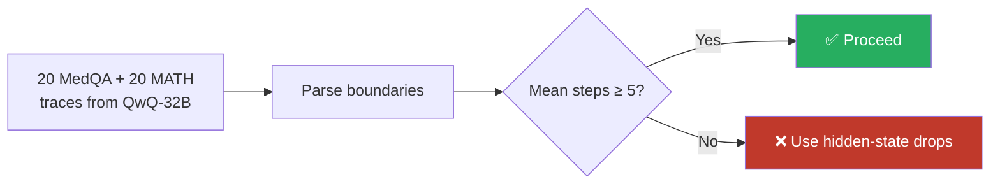

### Pilot 2: Embedding Signal

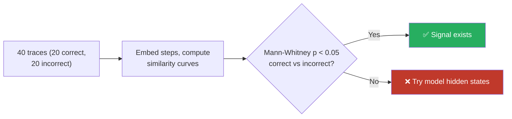

### Pilot 3: Marker Calibration

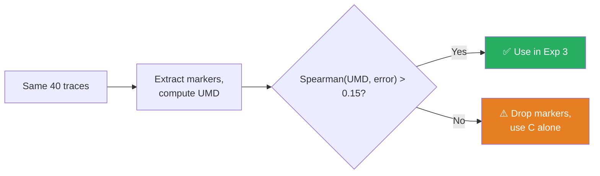

---

## Timeline

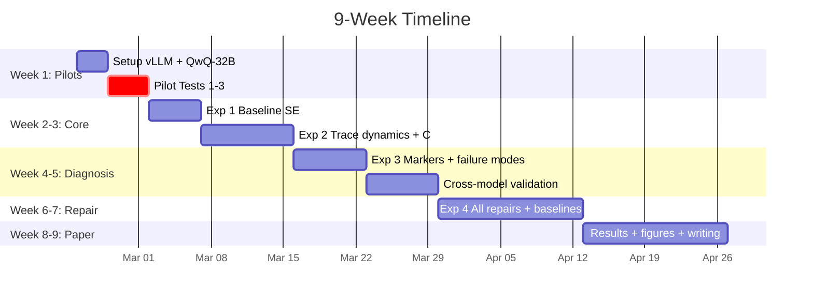

---

## Positioning Against Prior Work

| Prior Work                            | How we differ                                              |
| ------------------------------------- | ---------------------------------------------------------- |
| Semantic Entropy (Kuhn et al.)        | 1 trace vs k=5 samples; step dynamics not answer diversity |
| Reflexion (Shinn et al.)              | No oracle; repair from model's own trace structure         |
| Self-Consistency (Wang et al.)        | Analyze process, not just answers                          |
| Self-Refine (Madaan et al.)           | Diagnose _why_ then match repair type                      |
| Verbalized uncertainty (Xiong et al.) | Implicit signals (convergence), not explicit self-reports  |

---

## Files to Implement

| File                           | Experiment                       |
| ------------------------------ | -------------------------------- |
| `config.py`                    | All — hyperparameters, paths     |
| `model_manager.py`             | All — vLLM, `<think>` extraction |
| `datasets.py`                  | All — MedQA + MATH loaders       |
| `baseline_semantic_entropy.py` | Exp 1                            |
| `trace_segmenter.py`           | Exp 2 — boundary parsing         |
| `trace_dynamics.py`            | Exp 2 — sim, variance, drift     |
| `commitment_signature.py`      | Exp 2 — C detection              |
| `uncertainty_markers.py`       | Exp 3 — marker extraction        |
| `failure_modes.py`             | Exp 3 — ESC/LNC/ONC              |
| `repair_pipeline.py`           | Exp 4 — routed repair            |
| `latent_knowledge.py`          | Exp 4 — Repair A                 |
| `metrics.py`                   | All — AUROC, ECE, Spearman       |
| `run_pilots.py`                | Pilots 1-3                       |
| `run_experiment.py`            | Main CLI                         |
