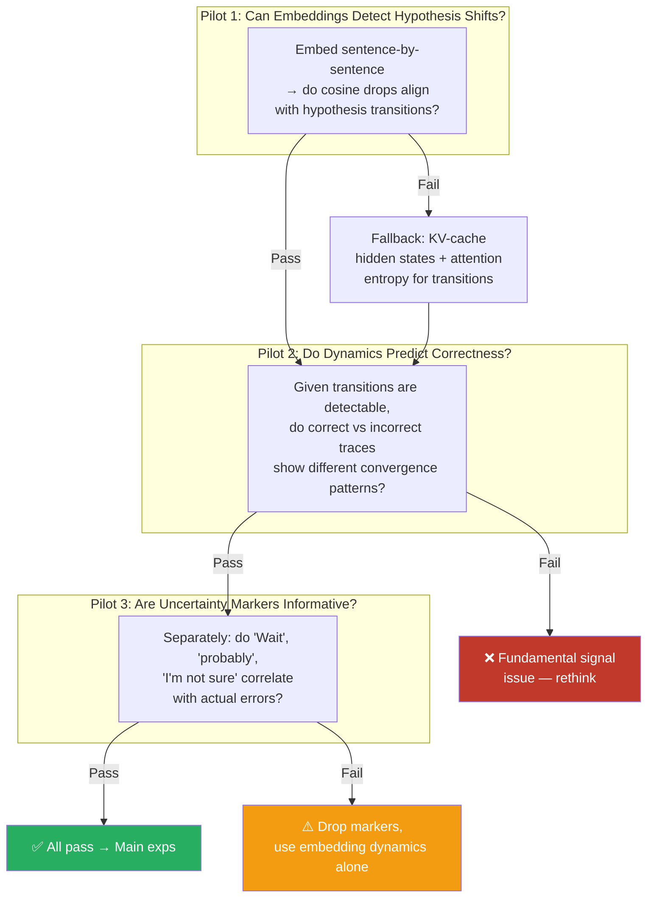
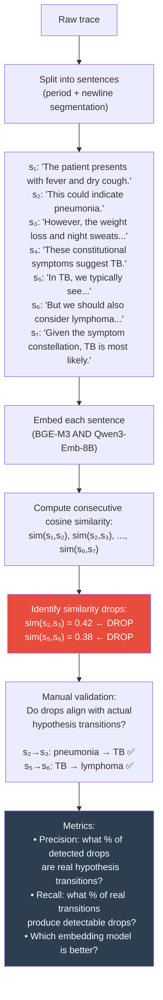
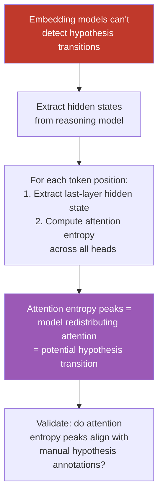
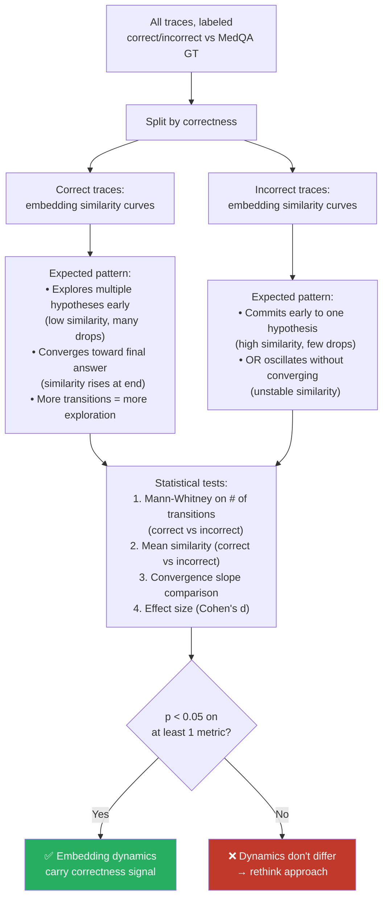
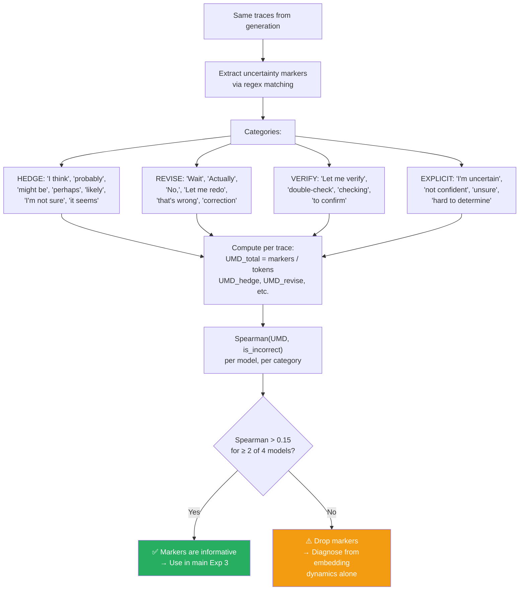
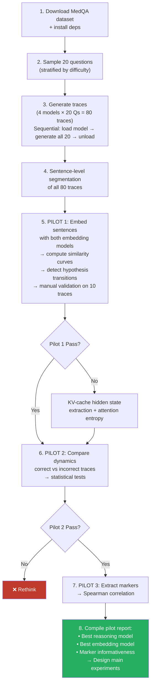

# Pilot Validation Plan (Corrected)

## Prompt Decision

**Choice: Minimal prompt.** Here's why, from an A* paper perspective:

| A* Conference Requirement | Why Minimal Prompt Satisfies It |
|---|---|
| **Generalizability** | Same prompt structure works for MedQA AND MATH — method contribution, not prompt engineering |
| **Reproducibility** | No complex chain-of-prompt dependencies a reviewer needs to replicate |
| **Clean ablation story** | If results come from a simple prompt, reviewers attribute the gain to *your method*, not to prompt tricks |
| **Reviewer concern averted** | Over-engineered prompts invite: "This works because of the prompt, not the method" |

The `<think>` trace emerges from the **model architecture** (QwQ, Qwen3 thinking mode), not from us telling the model how to reason. That's the whole point — we're measuring the model's *natural* reasoning dynamics.

### Prompt (Medical — MedQA)
```
You are a medical expert. Based on the following clinical case,
what is the most likely diagnosis?

{clinical_vignette}

A) {option_a}
B) {option_b}
C) {option_c}
D) {option_d}
```

### Prompt (Math — MATH Level 3-5, for main experiments)
```
Solve the following problem.

{problem_statement}
```

No "think step by step." No physician framing. The model's thinking mode handles that. Clean.

---

## Models

| Model | HuggingFace ID | BF16 VRAM | GPU Plan |
|-------|---------------|-----------|----------|
| QwQ-32B | `Qwen/QwQ-32B` | ~64GB | GPU 0+1 (TP=2) |
| Qwen3.5-27B | `Qwen/Qwen3.5-27B` | ~54GB | GPU 0+1 (TP=2) |
| Qwen3-8B | `Qwen/Qwen3-8B` | ~16GB | GPU 0 |
| Qwen3-4B-Thinking | `Qwen/Qwen3-4B-Thinking-2507` | ~8GB | GPU 0 |

**Embedding models** (compared head-to-head):

| Model | HuggingFace ID | VRAM | Why |
|-------|---------------|------|-----|
| BGE-M3 | `BAAI/bge-m3` | ~1.2GB | Established, efficient |
| Qwen3-Embedding-8B | `Qwen/Qwen3-Embedding-8B` | ~16GB | #1 MTEB, potentially better on reasoning text |

**Fallback**: If neither separates hypotheses → extract model's own hidden states (KV-cache last-token representations) as embeddings, using attention entropy to find hypothesis transition boundaries.

---

## What the Pilots Actually Test



---

## Pilot 1: Hypothesis Transition Detection

**Core question**: Can our embedding models tell when the model switches from reasoning about one diagnosis to another?

### How it works



### Segmentation: Sentence-Level, Not Marker-Level

The trace gets split at sentence boundaries (periods, newlines, paragraph breaks) — these are **linguistic units**, not reasoning signals. Every sentence is a data point for embedding.

| ✅ Sentence-level segmentation | ❌ Marker-level ("Wait", "Actually") |
|---|---|
| Based on language structure | Based on uncertainty signals |
| Every sentence is a data point | Only segments where model hedges |
| Tests if embeddings detect content shifts | Conflates segmentation with Pilot 3 |
| Works the same across all models | Marker vocabulary varies per model |

### What constitutes a "hypothesis transition"

For medical reasoning, a hypothesis transition is when the model shifts its reasoning focus to a **different diagnosis candidate**. Examples:

| Transition? | Example |
|---|---|
| ✅ Yes | "This looks like pneumonia" → "But the weight loss suggests TB" |
| ✅ Yes | "Considering infection" → "Could also be autoimmune" |
| ❌ No | "Pneumonia causes cough" → "Pneumonia also causes fever" (same hypothesis, adding evidence) |
| ❌ No | "The patient is 45" → "with chronic cough" (evidence gathering, no hypothesis yet) |

### Manual annotation protocol (10 traces)

Two annotators independently mark:
1. Which sentences introduce a **new hypothesis**
2. Which sentences provide **evidence for current hypothesis**
3. Which sentences **eliminate a hypothesis**

Compare annotated transitions against embedding similarity drops. Compute precision/recall. Cohen's κ > 0.6 for inter-annotator agreement.

### Pass/fail criteria

| Condition | Result |
|---|---|
| **Precision ≥ 0.6 AND Recall ≥ 0.5** for at least one embedding model | ✅ Pass — embeddings detect hypothesis transitions |
| One model passes, one doesn't | ✅ Pass — use the better model |
| **Both models below threshold** | ❌ Fail — fall back to KV-cache hidden states |

### KV-Cache Fallback (if embeddings fail)



This requires the reasoning model to still be loaded (generation + probing in single pass). Only triggered if Pilot 1 fails with both embedding models.

---

## Pilot 2: Embedding Dynamics Predict Correctness

**Core question**: Given that we can detect hypothesis transitions, do the *patterns* of transitions differ between correct and incorrect traces?



### Metrics to compute per trace

| Metric | What it captures |
|--------|-----------------|
| **Number of hypothesis transitions** (similarity drops below threshold) | How much the model explores |
| **Mean consecutive similarity** | Overall convergence tendency |
| **Similarity at midpoint** | How committed at halfway |
| **Similarity slope** (linear fit) | Rate of convergence |
| **Max similarity drop magnitude** | Sharpness of hypothesis shifts |
| **Final convergence** (last 3 sentences similarity) | How decisively it commits |

### Per-model × per-embedding-model analysis

Report a **4×2 table** (4 reasoning models × 2 embedding models) with p-values and effect sizes. This immediately tells us:
- Which reasoning model produces most differentiable traces
- Which embedding model captures the signal best

---

## Pilot 3: Uncertainty Marker Calibration

**Core question**: Do the model's own hedging and revision signals correlate with actual errors?

> [!NOTE]
> This is **completely independent** from Pilots 1-2. Pilots 1-2 test embedding-based hypothesis detection. Pilot 3 tests linguistic uncertainty signals. They measure different things.



### Why per-category matters
- REVISE markers ("Wait", "Actually") may be **structural** in some models (formulaic) → low correlation
- HEDGE markers ("probably", "might") may be **genuinely calibrated** → higher correlation
- Report each category separately. If only HEDGE correlates, use only HEDGE.

---

## Execution Order



---

## A* Paper Considerations Baked Into This Design

| Principle | How We Apply It |
|-----------|----------------|
| **Clean contribution boundary** | Method = intra-trace dynamics. Not prompt engineering, not model selection. |
| **Compute advantage narrative** | 1 trace vs k=5 for SE. We measure this in wall-clock during pilots. |
| **Ablation-ready** | 4 models × 2 embeddings is already an ablation table. Shows generalizability. |
| **Cross-domain** | Same method on medical (MedQA) + math (MATH L3-5). Pilots are medical; main exps add math. |
| **Baselines set early** | Pilot results directly shape which baselines to compare against. |
| **Negative results are fine** | If smaller models (4B) don't show signal but larger ones (32B) do, that's an interesting capacity-dependent finding. |
| **Reproducibility** | Open-weight models, minimal prompts, standard datasets, all code public. |

---

## Files to Create

| File | Purpose |
|------|---------|
| `src/config.py` | Model IDs, GPU mappings, paths, thresholds |
| `src/datasets.py` | MedQA loader + pilot sample selection |
| `src/generate_traces.py` | vLLM trace generation with `<think>` extraction |
| `src/sentence_segmenter.py` | Sentence-level trace segmentation |
| `src/embedding_pipeline.py` | BGE-M3 + Qwen3-Embedding-8B, cosine similarity |
| `src/pilot_hypothesis_detection.py` | Pilot 1: transition detection + manual validation |
| `src/pilot_dynamics.py` | Pilot 2: correct vs incorrect comparison |
| `src/pilot_markers.py` | Pilot 3: uncertainty marker extraction + Spearman |
| `src/run_pilots.py` | CLI entrypoint for all 3 pilots |
